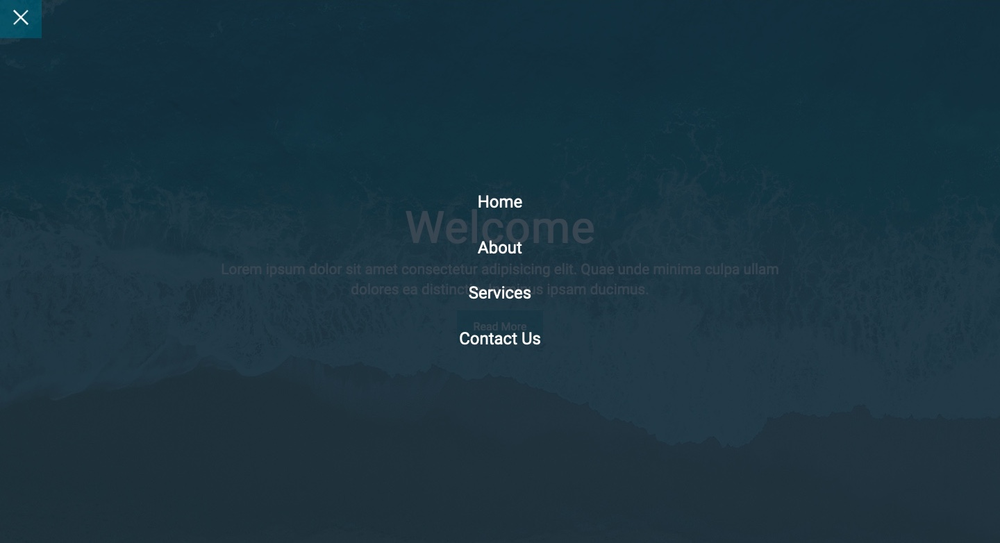

# CSS Hamburger Menu Overlay

In this project I have created a landing page with a pure CSS responsive hamburger menu (No JavaScript) with a bit of animation using CSS transitions.

## Table of contents

- [Overview](#overview)
  - [Screenshot](#screenshot)
  - [Links](#links)
- [My process](#my-process)
  - [Built with](#built-with)
- [Author](#author)

## Overview

### Screenshot

### Links

- Live Site URL: [Pure CSS Hamburger Menu Overlay](https://zoxabbasi.github.io/css-hamburger-menu-overlay/)

## My process

- Using CSS to style the page.
- Using transform, transitions, transition-delay and positions.
- Using multiples HTML elements for styling purposess.

### Built with

- Semantic HTML5 markup
- CSS custom properties

## Author

- Website - [Talal Abbasi](https://zoxabbasi.github.io/)
- Twitter - [@zoxabbasi](https://www.twitter.com/zoxabbasi)
